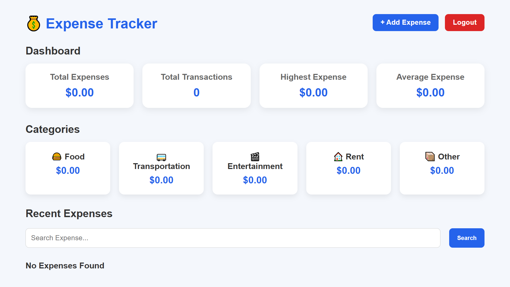

# 💰 Expense Tracker

A simple and practical **Expense Tracker web application** built with Django to help users record, manage, and monitor their daily expenses.

### 🚀 Key Features

* ➕ Add new expenses
* ✏️ Update existing expenses
* 🗑️ Delete expenses
* 📋 View all recorded transactions
* 🏷️ Categorize expenses
* 📊 Track total spending
* 🔍 Filter and manage expense records

### 🛠️ Technologies Used

**Python | Django | HTML | CSS | SQLite**

This project was built to strengthen my understanding of **Django web development, CRUD operations, database handling, and building practical web applications**.
